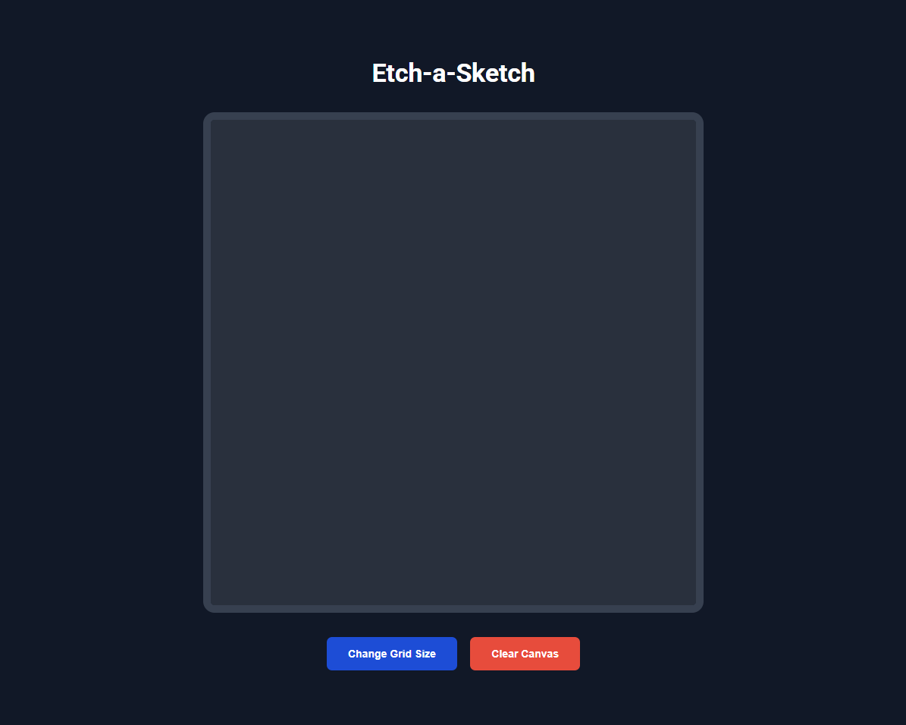

# Etch-a-Sketch
A browser-based digital sketchpad that combines the classic Etch-a-Sketch experience with modern web technologies. Create colorful pixel art with progressive darkening effects and customizable grid sizes. This project was completed as part of [The Odin Project's Foundations course](https://www.theodinproject.com/lessons/foundations-etch-a-sketch).

  

### Live Demo
You can try the Etch-a-Sketch [here](https://ar1ze.github.io/odin-etch-a-sketch/).